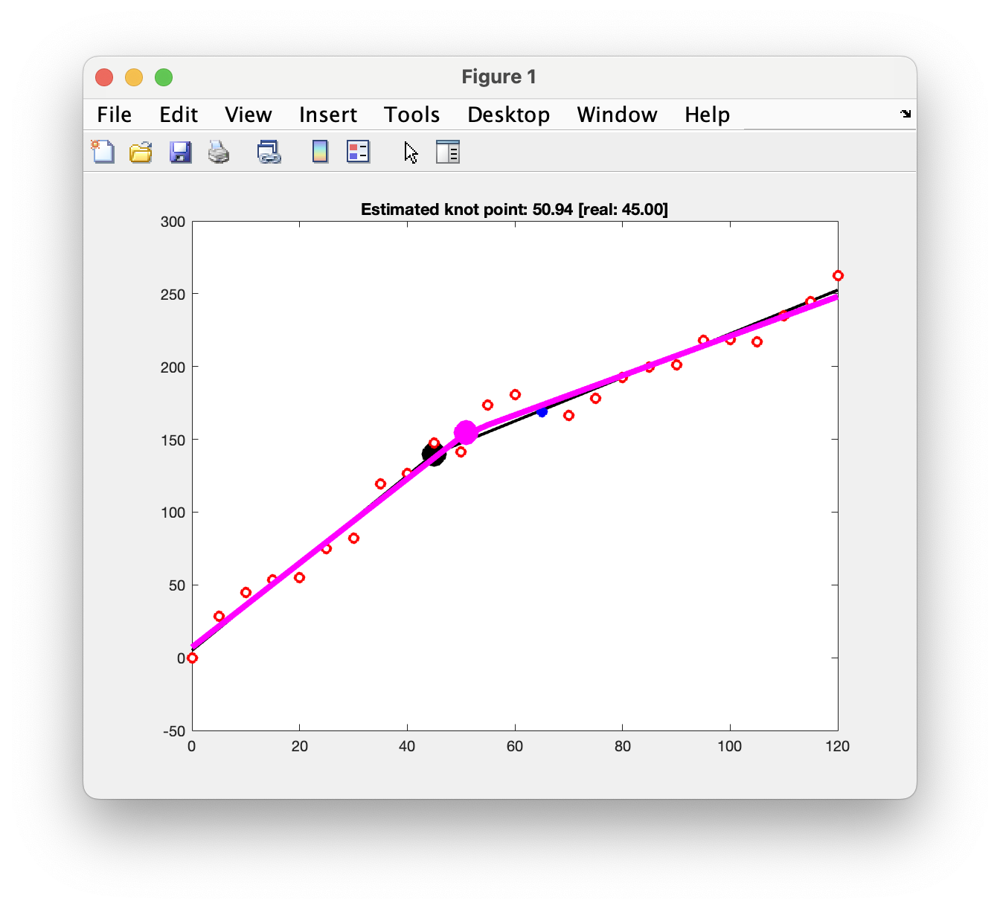
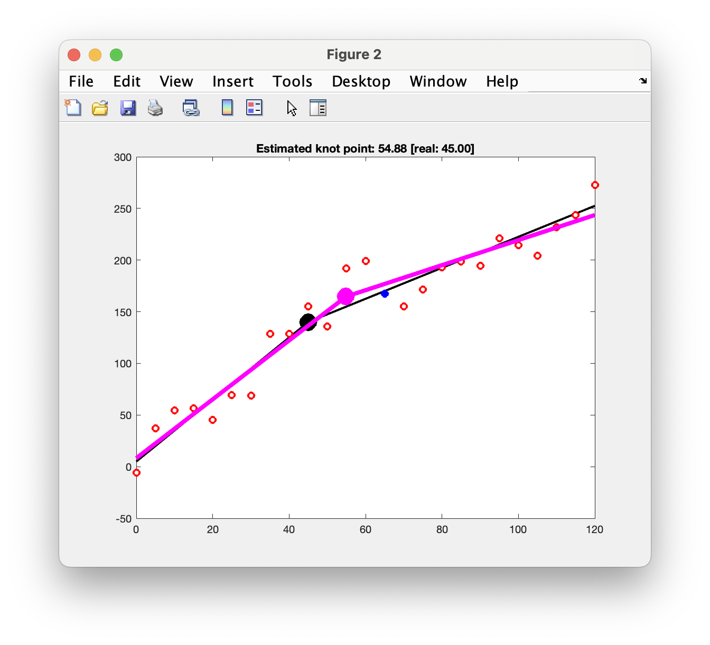
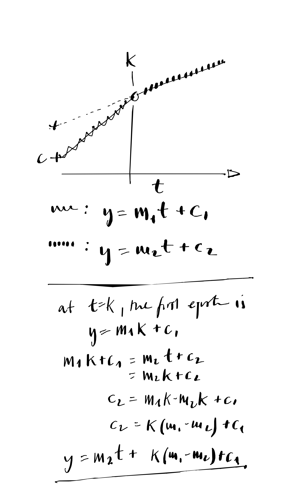

# piecewise-linear

find change in data / transition in piece-wise linear data (KW's thesis corrections)

ds, 2025-06-09

## Idea

use a piecewise linear model to find the change in data at some transition point in t.

1. first idea was to use the function `ischange()` - but it looks like that might not be doing the right thing.
2. second idea is what I have used before: use a piecewise linear model to find the change in data at some transition point in t and fit the data with `lsqcurvefit()` in MATLAB. The estimated transition point is then one of the parameters that is being estimated.

in `pwFunction()` I use the convention `x = [m1, m2, k, c1]` where `m1` and `m2` are the slopes of the two lines, `k` is the transition point and `c1` is the y-intercept of the first line.

and with a bit more noise

## Notes

The intercept of the second line segment depends on the parameters of the first  and the gradient of the second. Can figure this out with a bit of algebra.

